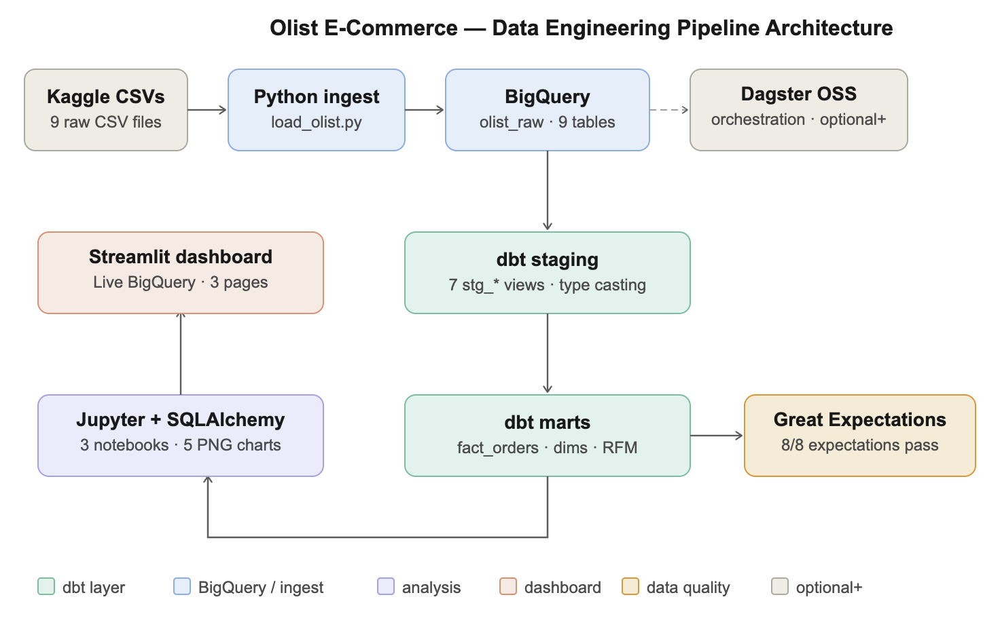
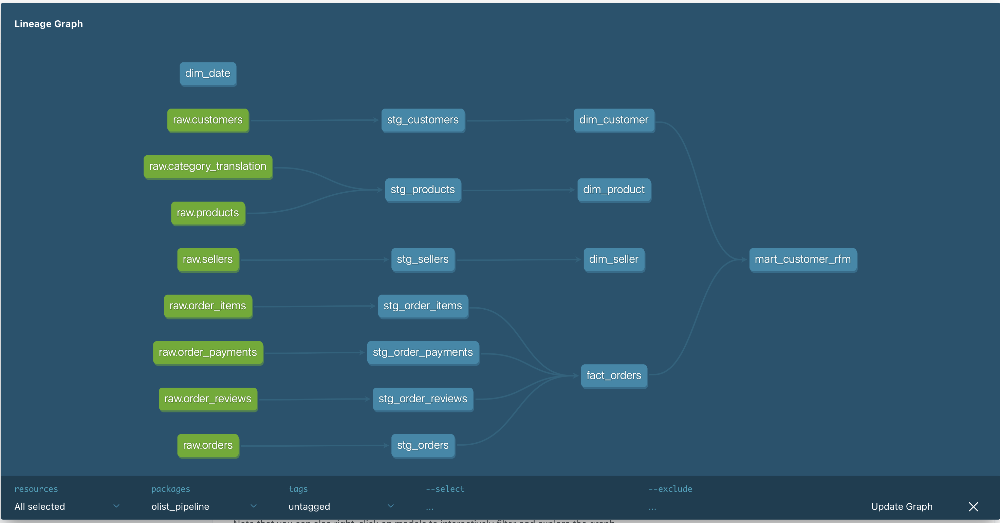
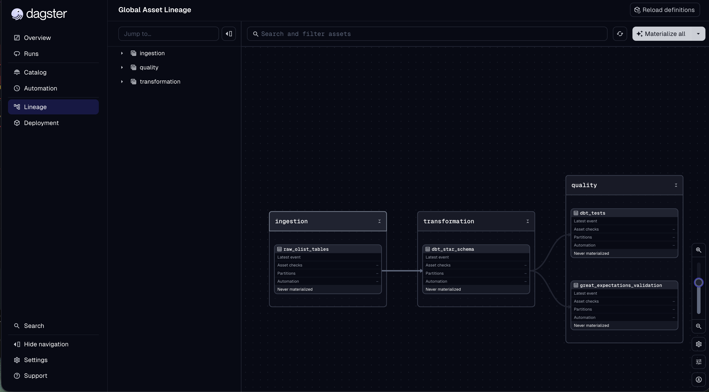

# Olist E-Commerce — End-to-End Data Engineering Pipeline


A portfolio data engineering project demonstrating a production-grade ELT pipeline
built on the Brazilian Olist e-commerce dataset (100K+ orders, 9 source tables).

## Live Dashboard

[🔗 Streamlit Dashboard](https://olist-pipeline-zjp7prmgx8cu28wcbnqco2.streamlit.app/)


## Business Context

Olist is a Brazilian marketplace connecting SME sellers to consumers. The raw data
arrives as 9 fragmented CSVs with no quality controls or analytical structure.
This pipeline transforms it into a queryable star schema with RFM customer
segmentation, revenue trend analysis, and automated data quality gates.

**Key finding:** Top 5% of customers (VIP + Big Spender segments) generate ~24%
of total GMV. November 2017 Black Friday peak: BRL 1.15M GMV in a single month.

## Target Audience

Data engineers and analysts who need a reference implementation of:
- ELT pipeline (extract → load raw → transform with dbt)
- Star schema design with derived business metrics
- Automated data quality validation (Great Expectations)
- Pipeline orchestration (Dagster Software-Defined Assets)
- Exploratory analysis with SQLAlchemy + Jupyter
- Interactive executive dashboard (Streamlit)

## Architecture



**Flow:** Kaggle CSVs → Python ingest → BigQuery olist_raw → dbt staging → dbt marts → Great Expectations → Jupyter/SQLAlchemy → Streamlit dashboard

## Stack

| Layer | Tool |
|---|---|
| Storage | BigQuery (GCP Free Tier · asia-southeast1) |
| Transformation | dbt Core 1.11 |
| Data Quality | dbt tests + Great Expectations 1.15 |
| Orchestration | Dagster OSS (Software-Defined Assets) |
| Analysis | Jupyter + SQLAlchemy + Plotly |
| Dashboard | Streamlit |
| Language | Python 3.11 (conda environment) |

## Project Structure

    olist-pipeline/
    ├── ingest/
    │   └── load_olist.py                       # Loads 9 CSVs → BigQuery olist_raw (569K rows)
    ├── dbt/olist_pipeline/
    │   ├── models/staging/                     # 7 stg_* views · type casting · null handling
    │   └── models/marts/                       # fact_orders · dim_customer · dim_product
    │                                           # dim_seller · dim_date · mart_customer_rfm
    ├── tests/
    │   └── ge_validation.py                    # Great Expectations · 8/8 expectations pass
    ├── notebooks/
    │   ├── 01_monthly_sales_trends.ipynb       # Monthly GMV · AOV · MoM growth
    │   ├── 02_product_category_analysis.ipynb  # Top 15 categories · review scores
    │   └── 03_customer_segmentation.ipynb      # RFM pie · revenue by segment · scatter
    ├── orchestration/
    │   ├── __init__.py                         # Dagster Definitions
    │   └── assets/__init__.py                  # 4 Software-Defined Assets
    ├── streamlit_app/
    │   └── app.py                              # 3-page dashboard · live BigQuery
    └── docs/
        ├── architecture_diagram.png
        ├── dbt_lineage_dag.png
        ├── dagster_asset_graph.png
        ├── olist_executive_deck.pptx
        └── chart_01_*.png ... chart_03_*.png

## Setup
```bash
git clone https://github.com/itorque2024/olist-pipeline.git
cd olist-pipeline

# Create and activate conda environment
conda create -n olist-pipeline python=3.11
conda activate olist-pipeline
pip install -r requirements.txt

# Authenticate with GCP
gcloud auth application-default login
```

## Running the Pipeline
```bash
conda activate olist-pipeline

# 1. Ingest raw data (place CSVs in data/raw/ first)
python ingest/load_olist.py

# 2. Transform with dbt
cd dbt/olist_pipeline
dbt run --select staging.* marts.*
dbt test --select marts.*

# 3. Data quality validation
cd ../..
python tests/ge_validation.py

# 4. Exploratory analysis
jupyter notebook notebooks/

# 5. Orchestration (Dagster)
export DAGSTER_HOME=$(pwd)/.dagster && mkdir -p .dagster
dagster dev -m orchestration
# Opens http://localhost:3000

# 6. Dashboard (Streamlit)
streamlit run streamlit_app/app.py
# Opens http://localhost:8501
```

## Key Results

| Metric | Value |
|---|---|
| fact_orders rows | 112,650 |
| Unique customers (RFM) | 93,400 |
| Peak GMV month | Nov 2017 — BRL 1.15M (Black Friday) |
| Top revenue category | health_beauty — BRL 1.41M |
| Late delivery rate | 6.6% nationally |
| Avg review score | 4.08 / 5 |
| dbt tests | 28/29 PASS |
| GE expectations | 8/8 PASS |
| Pipeline run time | < 3 min on BigQuery free tier |
| Infrastructure cost | $0/month |

## Design Decisions

**Why star schema over 3NF?**
Star schema enables single-table analytical queries without complex joins.
`fact_orders` at order-item grain answers revenue, delivery, and review questions
in one scan. BigQuery's columnar storage makes wide fact tables cheap.

**Why partition `fact_orders` by `order_purchase_date`?**
Analytical queries almost always filter by date range. Partitioning eliminates
full table scans — a query for 2018 only reads 2018 partitions (~40% of data).

**Why dbt over raw SQL scripts?**
dbt enforces dependency ordering via DAG, enables `ref()` for lineage tracking,
and generates documentation automatically. Raw scripts have no DAG awareness
and break silently when upstream tables change.

**Why BigQuery over Postgres?**
Serverless — no infrastructure to manage. Free tier covers this dataset
(10 GB storage + 1 TB queries/month). Scales to 10× data without schema changes.

**Why Great Expectations over custom SQL tests?**
GE produces an HTML report artifact suitable for stakeholder review.
dbt tests catch structural issues; GE catches business logic violations
(e.g. review scores outside 1–5, row count outside expected range).

**Why Dagster over Airflow?**
Dagster's Software-Defined Assets model the pipeline as data assets with
lineage, not just task DAGs. The asset graph gives immediate visibility into
what data exists, when it was last updated, and what depends on what.

## dbt Lineage



## Dagster Asset Graph



## Business Recommendations

**① VIP Retention** — Only 34 VIP customers exist but avg LTV of BRL 1,000 is 8×
the One-Timer segment. Deploy 90-day win-back emails before churn.

**② Seller Quality Incentive** — Introduce tiered commission: top-quartile sellers
(4.2+ review score) pay 8% vs standard 12%.

**③ Category Mix Rebalance** — Shift 20% of marketing spend to Health/Beauty
(BRL 1.41M, 4.19 review) and Watches/Gifts (highest AOV at BRL 216).

## Deliverables

- GitHub repo (this) — all code, single main branch
- 3 Jupyter notebooks with EDA and charts
- Executive slide deck — `docs/olist_executive_deck.pptx`

## Data Source

[Olist Brazilian E-Commerce Dataset](https://www.kaggle.com/datasets/olistbr/brazilian-ecommerce)
· Kaggle · CC BY-NC-SA 4.0

## Author

**Lewis Chen** — Data Engineering & AI Portfolio  
Singapore · NTU DSAI · Module 2 Data Engineering  
